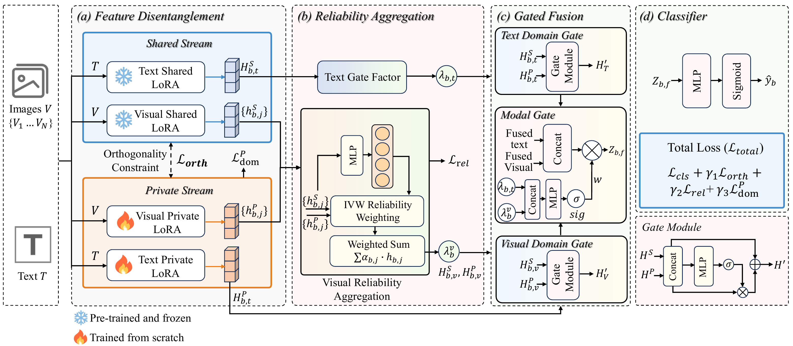

# DURA

**DURA: Dual-Stream LoRA with Reliability-Aware Fusion for Multi-Domain Multimodal Fake News Detection**

DURA is a multimodal fake news detection framework designed for domain-aware
multi-domain learning under domain discrepancy and modality irregularity. It
separates shared forensic priors from domain-sensitive residual semantics, then
uses reliability-aware visual aggregation and gated multimodal fusion to reduce
the influence of weak, missing, or noisy visual evidence.

## Framework

[](assets/figure2.pdf)

## Overview

Multimodal fake news on social media often contains heterogeneous domain styles,
imbalanced domain distributions, noisy multi-image evidence, and incomplete
modalities. DURA addresses these issues with a dual-stream LoRA architecture:

- A frozen shared stream preserves domain-invariant forensic priors.
- A trainable private stream captures domain-sensitive residual semantics.
- A semantic orthogonality constraint reduces redundant overlap between the two
  streams.
- DARE-based adapter merging constructs the shared stream from domain-specific
  LoRA adapters.
- Reliability aggregation estimates task-relevant visual evidence and suppresses
  weak or noisy image instances.
- Gated fusion dynamically recalibrates text-image contributions for the final
  prediction.

## Repository Structure

```text
dura/
  config.py                  Configuration dataclasses and YAML loading
  data.py                    Dataset construction and batch preparation
  feature_cache.py           Feature caching utilities
  model.py                   DURA model and backbone wrappers
  pipeline.py                End-to-end experiment pipeline
  train.py                   Training entry definitions
  common/                    Logging, checkpointing, seeding, and I/O helpers
  data_utils/                Data loading, cleaning, sampling, and split helpers
  eval_utils/                Metrics, reports, and threshold utilities
  modules/                   LoRA adapters and loss functions
  pipeline_utils/            DARE adapter merging utilities
  viz/                       Representation visualization utilities

scripts/
  run_dura.py                Command-line entry for training and evaluation

assets/
  figure2.pdf                Framework diagram in PDF format
  figure2.png                Framework diagram preview for GitHub rendering

requirements.txt             Python dependency list
LICENSE                      Apache-2.0 license
```

## Method Highlights

**Dual-stream feature disentanglement.** DURA uses separate shared and private
LoRA streams to model invariant fake-news detection logic and domain-sensitive
residual cues.

**DARE-based shared stream construction.** Domain-specific LoRA adapters are
merged into a shared plugin through DARE-style sparsification and rescaling,
which helps preserve useful common knowledge while reducing domain interference.

**Orthogonality-constrained representation learning.** A semantic orthogonality
loss encourages the shared and private post-level representations to capture
complementary information.

**Reliability aggregation for visual evidence.** Multi-image posts are handled
with reliability weighting so that informative visual instances receive stronger
aggregation weights than weakly relevant or noisy instances.

**Gated multimodal fusion.** DURA uses domain reintegration gates and a modal
gate to recalibrate fused text-image representations before classification.

## Installation

```bash
git clone https://github.com/ALateFall/DURA.git
cd DURA

python -m venv .venv
source .venv/bin/activate

pip install --upgrade pip
pip install -r requirements.txt
```

Install the PyTorch build that matches your CUDA environment if the default
package resolver does not select the desired CUDA version.

## Data Preparation

For the Weibo and Weibo21 datasets, please request access from the original
dataset authors. For GossipCop, please obtain the benchmark data from the
official FakeNewsNet release. After obtaining the benchmark data, prepare a
local YAML configuration file that points to your dataset location.

## Training and Evaluation

DURA is configured through a YAML file whose fields correspond to the
dataclasses in `dura/config.py`. The command below runs training, validation
threshold selection, and final test evaluation:

```bash
python scripts/run_dura.py --config path/to/dura_config.yaml
```

Configuration values can also be overridden from the command line:

```bash
python scripts/run_dura.py --config path/to/dura_config.yaml \
  --override paths.dataset_root=/path/to/authorized_dataset \
  --override paths.output_root=outputs/dura_run \
  --override data.dataset_name=weibo21 \
  --override clip.local_files_only=false
```

Component-removal variants can be launched with the same entry point:

```bash
python scripts/run_dura.py --config path/to/dura_config.yaml \
  --override experiment.ablation=w/o_ivw
```

```bash
python scripts/run_dura.py --config path/to/dura_config.yaml \
  --override experiment.ablation=w/o_adaptive
```

## Outputs

Each run writes its artifacts under the configured `paths.output_root`,
including:

```text
<output_root>/<run_name>/
  run_config.json
  summary.json
  split_map.json
  audit/
  checkpoints/
    dura_best.pt
    val_report.json
    test_report.json
    test_per_domain.csv
    predictions_val.json
    predictions_test.json
```

## Benchmarks

The method is evaluated in the paper on three representative multimodal fake
news detection benchmarks:

- Weibo
- Weibo21
- GossipCop

## Citation

If you use DURA in your research, please cite:

```bibtex
@article{pu2026dura,
  title  = {DURA: Dual-Stream LoRA with Reliability-Aware Fusion for Multi-Domain Multimodal Fake News Detection},
  author = {Pu, Ao and Feng, Xia and Liang, Gang and Zhao, Kui and Hu, Haixin and Xu, Yani and Wang, Lei},
  year   = {2026}
}
```

## License

This project is released under the Apache License 2.0.
